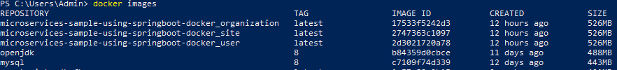
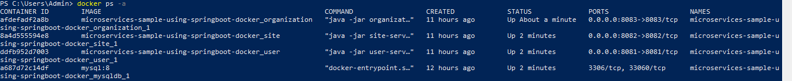

# Deploying and Running Multiple Spring Boot Microservices with MySql using Docker Compose
Building multiple microservices using Spring Boot, and deploying and running them using docker compose.

## Table of contents
* [Architecture](#architecture)
* [Technologies](#technologies)
* [Getting Started](#getting-started)
* [Sample Requests](#sample-requests)
* [About me](#about-me)
* [Acknowledgments](#acknowledgments)

## Architecture
The project follows the *microservices* architectural style. 
We have three independent microservices (User, Site and Organization), which connect to MySql database and  communicate with each other using RestTemplate. We use *Docker Compose* for deploying and running them on docker containers.

## Technologies
This project is created using the following technologies:

1. Java 8
2. Maven Dependency Management	
3. Spring Boot in microservices development:
	
	+ Spring Web
	+ Spring Data JPA
	+ Spring Devtools
	+ Spring Actuator
	
4. MySql database
5. Docker

## Getting Started

These instructions will get you a copy of the project up and running on your local machine for development and testing purposes.

### Prerequisites
You need to install the following software:
 * Java JDK 1.8+
 * Maven 3.0+
 * Git client
 * Docker Compose: To [install docker-compose](https://docs.docker.com/compose/install/)

### Developing Steps
The steps to be taken in order to create working microservices-based system using Spring boot and Docker:
	
**Step 1.** Building the *microservices* using Spring Boot and communication between them by RestTemplate:

 	+ [User microservice](user-service)
 	+ [Site microservice](site-service)
 	+ [Organization microservice](organization-service)

**Step 2.** Creating the *Dockerfile* for each service. Docker file is a list of commands that we want the docker engine to execute. 

Go to the directory for each spring boot project and create a Dockerfile:
	+ User microservice [Dockerfile](user-service/Dockerfile)
	+ Site microservice [Dockerfile](site-service/Dockerfile)
	+ Organization microservice [Dockerfile](organization-service/Dockerfile)

For example Dockerfile for User service:

	```bash
		From openjdk:8
		copy ./target/users-service-0.0.1-SNAPSHOT.jar user-service.jar
		CMD ["java","-jar","user-service.jar"]
	```

**Step 3.** Creating [docker-compose.yml](docker-compose.yml) as follows:

	```bash
		version: "3"
		services:
		  organization:
		    build: ./organization-service
		    ports:
		      - "8083:8083"
		    networks:
		      - organization-mysql
		      - organization-user
		      - organization-site
		    depends_on:
		      - mysqldb
		      - user
		      - site
		
		  site:
		    build: ./site-service
		    ports:
		      - "8082:8082"
		    networks:
		      - organization-mysql
		      - site-user
		      - organization-site
		    depends_on:
		      - mysqldb
		      - user
		 
		  user:
		    build: ./user-service
		    ports:
		      - "8081:8081"
		    networks:
		      - site-user
		      - organization-user
		      - organization-mysql
		    depends_on:
		      - mysqldb
		
		  mysqldb:
		    image: mysql:8
		    networks:
		      - organization-mysql
		    environment:
		      - MYSQL_ROOT_PASSWORD=root
		      - MYSQL_DATABASE=organizationdb
		
		networks:
		  organization-mysql:
		  site-user:
		  organization-user:
		  organization-site:
	```
**Step 4.** Running and testing applications: 
		Run docker-compose up and Compose starts and runs your entire services.
 
### Setup
To run this project, install it locally as follow:

1. **Clone the application**

	```bash
	git clone https://github.com/SayedBaladoh/Deploying-and-Running-Multiple-Spring-Boot-Microservices-with-MySql-using-Docker-Compose.git
	```

2. **Create a JAR file for each service**

	Run maven command - *clean install*, and a jar file gets created in the target directory for each service like so:

	```bash
		cd service_directory
		maven clean install
	```	
	+ *service_directory*: the directory of the service (user-service, site-service and organization-service).	

3. **Start the User, Site, Organization and MySql using docker-compose**

	The project includes a [*docker-compose.yml*](docker-compose.yml)  file so you can Run *docker-compose up* to start entire services, no installation needed.

	```bash
		cd solution_directory
		docker-compose up -d
	```
	We can see that - 
	- Building an image from Dockerfile for each service and image for MySql database If it does not exist.
	- Building containers (user, site, organization, and mysql) using the images.
	- Starting the services (user, site, organization, and MySql).
	
4. **Check the created images**

	Use the following command to check the created images:

	```bash
		docker images
	```
	
		You should find the created images like in the next figure:
		

5. **Check the created containers**

	Use the following command to check the created containers:

	```bash
		docker ps -a
	```

		You should see the results like the next:
			
		
6. **Check the logs**

	Use the following command to check the logs for each container:

	```bash
		docker container logs CONTAINER_ID
	```
	
### Running

To access the services use the following endpoints

**Run the User/Site/Organization microservices**
	
	The user microservice will start on port `8081`, So you'll be able to visit the user microservice under address `http://localhost:8081`. 
	
	The site microservice will start on port `8082`, So you'll be able to visit the site microservice under address `http://localhost:8082`.

	The organization microservice will start on port `8083`, So you'll be able to visit the organization microservice under address `http://localhost:8083`. 

	+ View info about `API Gateway` service 
		* http://localhost:8081/actuator/info
		* http://localhost:8082/actuator/info
		* http://localhost:8083/actuator/info
	
	+ Check Health for `API Gateway` service
		* http://localhost:8081/actuator/health
		* http://localhost:8082/actuator/health
		* http://localhost:8083/actuator/health
		
	+ Access User/Site/Organization services APIs:
	* `user-service`: http://localhost:8081/api/users
	* `site-service`: http://localhost:8081/api/sites
	* `organization-service`: http://localhost:8081/api/organizations

## Sample Requests
CURL GET command samples for different (User, Site, Organization) microservices:

### User APIs
* Display info about User microservice
	
	```bash
		curl -X GET 	'http://localhost:8081/actuator/info' 
	```
	
* Check Health for User microservice

	```bash
		curl -X GET 'http://localhost:8081/actuator/health'
	```
	
* List all users
	
	```bash
		curl -X GET 'http://localhost:8081/api/users'
	```

* Find user by Id

	```bash
		curl -X GET 	'http://localhost:8081/api/users/1'
	```
	
* Filter users by SiteId

	```bash
		curl -X GET 	'http://localhost:8081/api/users/site/3'
	```
	
* Filter users by OrganizationId

	```bash
		curl -X GET 	'http://localhost:8081/api/users/organization/1'
	```

### Site APIs

* Display info about Site microservice
	
	```bash
		curl -X GET 	'http://localhost:8082/actuator/info'
	```
	
* Check Health for Site microservice

	```bash
		curl -X GET 	'http://localhost:8082/actuator/health'
	```
	
* List all sites
	
	```bash
		curl -X GET 'http://localhost:8082/api/sites'
	```

* Find site by Id

	```bash
		curl -X GET 'http://localhost:8082/api/sites/1'
	```
	
* Filter sites by OrganizationId

	```bash
		curl -X GET 	'http://localhost:8082/api/sites/organization/1'
	```
	
* Filter sites with users by OrganizationId

	```bash
		curl -X GET 'http://localhost:8082/api/sites/organization/1/with-users'
	```

### Organization APIs

* Display info about Organization microservice
	
	```bash
		curl -X GET 'http://localhost:8083/actuator/info'
	```
	
* Check Health for Organization microservice

	```bash
		curl -X GET 'http://localhost:8083/actuator/health'
	```
	
* List all organizations
	
	```bash
		curl -X GET 'http://localhost:8083/api/organizations'
	```

* Find organization by Id

	```bash
	curl -X GET 	'http://localhost:8083/api/organizations/1'
	```

* Find organization with sites by Id

	```bash
	curl -X GET 'http://localhost:8083/api/organizations/1/with-sites'
	```
* Find organization with sites and users by Id

	```bash
	curl -X GET 'http://localhost:8083/api/organizations/1/with-sites-with-users'
	```

* Find organization with users by Id

	```bash
	curl -X GET 'http://localhost:8083/api/organizations/1/with-users'
	```

## About me

I am Sayed Baladoh - Phd. Senior Software Engineer. I like software development. You can contact me via:

* [LinkedIn+](https://www.linkedin.com/in/sayed-baladoh-227aa66b/)
* [Mail](mailto:sayedbaladoh@yahoo.com)
* [Phone +20 1004337924](tel:+201004337924)

_**Any improvement or comment about the project is always welcome! As well as others shared their code publicly I want to share mine! Thanks!**_

## Acknowledgments

Thanks for reading. 
Did I help you?

+ Share it with someone you think it might be helpful.
+ Give a star to this project
